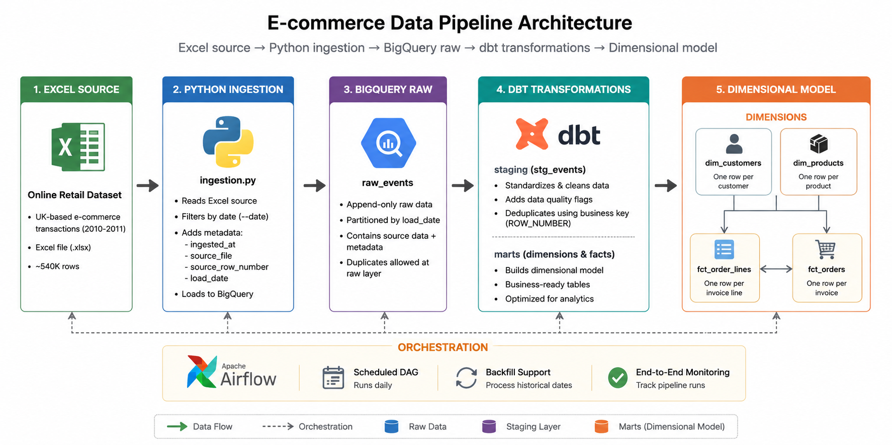
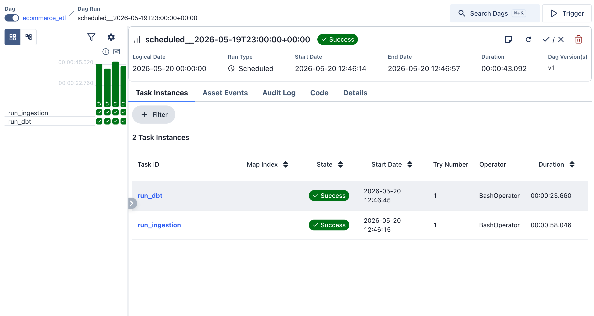
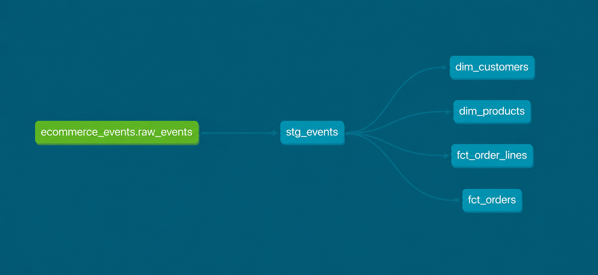
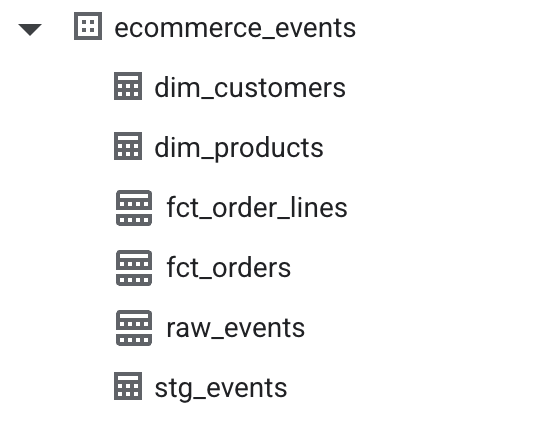

# E-commerce Data Pipeline

> An end-to-end data pipeline that ingests e-commerce transaction data, transforms it through a dimensional warehouse, and orchestrates daily batch processing. Built as a portfolio project to demonstrate incremental loading, deduplication, automated testing, and workflow orchestration using modern data engineering tools.

**Tech Stack:** Python • BigQuery • dbt • Apache Airflow

**Dataset:** [Online Retail Dataset](https://archive.ics.uci.edu/dataset/352/online+retail) - 541,000+ transactions from a UK online retailer (2010-2011)

---

## Architecture

### System Diagram


### Data Flow

**1. Ingestion Layer**
Python script extracts transactions for a specific date from Excel source, adds metadata (ingested_at, source_file, load_date), and loads to BigQuery raw_events table (partitioned by load_date).

**2. Staging Layer**
dbt transforms raw data: standardizes formatting (UPPER, TRIM), adds quality flags (negative quantities, missing customer IDs), calculates derived fields (line_value), and deduplicates using window functions (keeping most recent ingestion per business key).

**3. Marts Layer**
dbt builds dimensional model:
- **Dimensions:** dim_products (one row per stock_code), dim_customers (one row per customer_id, excludes guests)
- **Facts:** fct_order_lines (transaction-level detail), fct_orders (order-level aggregates)

### Warehouse Design

**Dimensional Model:**

Raw → Staging → Marts (Dimensions + Facts)

**Key Design Principles:**
- Raw layer accepts all data (no filtering)
- Staging layer cleans and flags issues (preserves all rows)
- Dimensions contain descriptive attributes (who, what, where)
- Facts contain metrics and foreign keys (how much, when)
- Quality flags enable filtered analysis without data loss

---

## Key Features

### ✅ Incremental Data Ingestion
Ingestion script processes one date at a time rather than loading the entire dataset at once. Enables reprocessing of individual dates, reduces memory footprint, and mirrors production batch job patterns. Airflow orchestrates sequential date processing via backfill commands.

### ✅ Deduplication Logic
Source data contains 377 duplicate transactions. Raw layer accepts all data; staging layer deduplicates using `ROW_NUMBER()` window functions partitioned by business key (invoice_no + stock_code + invoice_date), keeping the most recent ingestion. Handles both source duplicates and accidental pipeline re-runs.

### ✅ Automated Data Quality Testing
22 dbt tests validate data integrity across all layers:
- Primary key uniqueness and completeness
- Foreign key relationships between facts and dimensions
- Required field validation
Tests run automatically after each transformation, failing the pipeline if issues detected.

### ✅ Workflow Orchestration
Airflow DAG coordinates ingestion and transformation tasks with proper dependency management. Supports manual triggers, scheduled runs, and historical backfilling. Task-level logging enables granular debugging.

### ✅ Dimensional Modeling
Star schema with 2 dimensions (products, customers) and 2 fact tables (order lines, orders). Separates descriptive attributes from metrics, optimizes for analytical queries, and maintains referential integrity through dbt tests.

---

## Design Decisions & Trade-offs

**Why dimensional modeling?**
Separates descriptive attributes from metrics, enabling efficient aggregation queries. Trade-off: More complex setup, simpler long-term analysis.

**Why deduplicate in staging, not ingestion?**
Raw layer = immutable audit trail. Staging handles deduplication, allowing reprocessing with different rules. Trade-off: Raw contains duplicates, slight storage increase.

**Why partition by load_date?**
Enables efficient incremental processing and reprocessing scenarios. Trade-off: Queries by invoice_date span partitions.

**Why full-refresh dbt?**
Dataset size manageable, simpler implementation, ensures dimensional consistency. Trade-off: Longer transforms vs. incremental complexity.

**Other choices:**
- Local Airflow (zero cost for learning; production would use cloud)
- Quality flags vs. dropping bad rows (preserves data, requires analyst filtering)

---

## Technologies

| Component | Technology | Purpose |
|-----------|-----------|---------|
| Ingestion | Python + Pandas | Extract and load from Excel to BigQuery |
| Warehouse | Google BigQuery | Cloud data warehouse |
| Transformation | dbt | SQL-based transformations, testing, documentation |
| Orchestration | Apache Airflow | Workflow scheduling and monitoring |
| Version Control | Git | Code management |

---

## Repository Structure
```
ecommerce-data-pipeline/
├── src/                    # Python ingestion scripts
├── ecommerce_dbt/          # dbt models, tests, documentation
│   └── models/
│       ├── staging/        # Data cleaning and deduplication
│       └── marts/          # Dimensional model (dims + facts)
├── airflow/                # Orchestration DAGs and config
├── data/                   # Source data (Excel)
└── sql/                    # Legacy SQL scripts (pre-dbt)
```
---

## Screenshots

### Airflow DAG Execution

*Sequential execution of ingestion and dbt tasks*

### dbt Lineage Graph

*Data flow from staging through dimensional model*

### BigQuery Dimensional Model

*Dimensional model in BigQuery*

---

## Contact

Dominic Barry  
[LinkedIn] • [Portfolio](https://dominicbarry.github.io/portfolio) • [GitHub](https://github.com/DominicBarry)